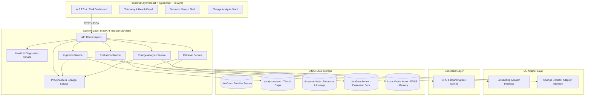

# A.S.T.R.A. Architecture Specification

**Project:** A.S.T.R.A. (*Automated Semantic Tracking and Retrieval Architecture*)  
**Architecture Style:** Modular Monolith (Anti-bloat guardrail)  
**Deployment Target:** Air-gapped / Local Offline Execution  
**Current Phase:** Phase 0 (Foundation)

---

## 1. System Overview

A.S.T.R.A. is engineered to deliver high-throughput, semantically guided satellite imagery retrieval and temporal change detection without relying on cloud infrastructure, external vector DB clusters, or cloud-hosted foundation model APIs.



---

## 2. Architectural Principles

### 2.1 Modular Monolith vs. Distributed Microservices
In compliance with project guardrails:
- We explicitly reject distributed microservices, Kubernetes, Kafka, and external cloud messaging for Phase 0 and intermediate prototypes.
- The system is packaged as a single deployable unit with strictly bounded internal Python modules (`ingestion`, `retrieval`, `change_analysis`, `provenance`, `evaluation`).
- Each module has well-defined interfaces and can later be extracted into background workers or services if and only if justified by verified profiling data.

### 2.2 Strict Offline Operation
- No runtime network egress. All model weights, geospatial reference files, and dependencies are staged locally.
- A central configuration parameter `ASTRA_OFFLINE_MODE=true` is enforced across all subsystems.

### 2.3 Model Adapter Pattern
Foundation models evolve rapidly. Hard-coding specific model architectures (e.g., CLIP, SatMAE, Prithvi, Clay, RemoteCLIP) creates technical debt and prevents objective benchmarking.
- The `ml/` package defines abstract interfaces (`BaseEmbeddingAdapter`, `BaseChangeDetectorAdapter`).
- Backend services consume these interfaces exclusively.
- Candidate models are benchmarked via `backend/evaluation` before declaring any default.

---

## 3. Subsystem Breakdown

### 3.1 Frontend (`frontend/`)
- **Technology:** React 19, TypeScript, Tailwind CSS, Vite.
- **Role:** Interactive analyst interface for search query composition, dual-temporal inspection, change heatmap overlay, and system health telemetry.
- **Design Philosophy:** Minimalist, high-contrast dark aesthetic, rapid rendering, robust error handling with offline status indicators.

### 3.2 API Layer (`backend/api/`)
- **Technology:** FastAPI, Pydantic v2, Starlette.
- **Role:** Route dispatching, request validation, serialization, error handling, CORS headers for local origin.
- **Prefix:** `/api/v1`

### 3.3 Ingestion Subsystem (`backend/ingestion/`)
- **Role:** Ingests raw satellite scenes (GeoTIFF/COG), extracts CRS, bounding box, sensor, and timestamps, and tiles them into georeferenced chips with deterministic IDs (`tile_id`).

### 3.4 Provenance Subsystem (`backend/provenance/`)
- **Role:** Maintains cryptographic hash IDs and lineage trees. Ensures that every tile remains permanently linked to its source scene ID, along with processing transforms.

### 3.5 Retrieval Subsystem (`backend/retrieval/`)
- **Role:** Orchestrates semantic queries (text-to-image, image-to-image). Generates query embeddings using the active `BaseEmbeddingAdapter` and retrieves top-$k$ nearest neighbors from the local vector index.

### 3.6 Change Analysis Subsystem (`backend/change_analysis/`)
- **Role:** Pairs co-registered tiles across temporal acquisitions ($T_1, T_2$), executes change detection models via `BaseChangeDetectorAdapter`, and outputs pixel masks and transition metrics.

### 3.7 Evaluation Subsystem (`backend/evaluation/`)
- **Role:** Executes automated benchmarking against standard datasets in `data/benchmark/`, calculating precision, recall, mAP, and IoU. Enforces zero fabrication of metrics.

### 3.8 Machine Learning Adapters (`ml/`)
- Abstract base classes defining methods:
  - `encode_text(prompt: str) -> np.ndarray`
  - `encode_image(image: np.ndarray) -> np.ndarray`
  - `detect_change(image_t1: np.ndarray, image_t2: np.ndarray) -> ChangeResult`

### 3.9 Geospatial Contracts (`geospatial/`)
- Validates CRS formats (EPSG/WKT), bounding box coordinates, spatial resolutions, and ensures coordinate transformation accuracy.

---

## 4. Component Communication & Data Flow

```text
[Analyst / Client]
       │
       ▼ (HTTP / JSON)
[FastAPI Router (/api/v1)]
       │
   ┌───┴────────────────────────┬────────────────────────┐
   ▼                            ▼                        ▼
[GET /health]        [POST /search/semantic]     [POST /change/analyze]
   │                            │                        │
[HealthService]      [RetrievalService]          [ChangeAnalysisService]
   │                            │                        │
   │                            ▼                        ▼
   │                   [EmbeddingAdapter]        [ChangeDetectorAdapter]
   │                            │                        │
   │                            ▼                        ▼
   │                   [Local FAISS Index]       [Difference Calculator]
   │                            │                        │
   └────────────────────────────┼────────────────────────┘
                                ▼
                       [JSON API Response]
```

---

## 5. Security & Air-Gap Compliance
- **Zero Ingress/Egress Requirement:** System can run completely disconnected from the Internet.
- **Local Network Isolation:** Backend binds to `127.0.0.1` by default; CORS is restricted to local frontend development origins.
- **Immutable Provenance:** Any synthetic or test tile is labeled with `is_synthetic: true` in its manifest, guaranteeing reproducible research and clean auditing.
