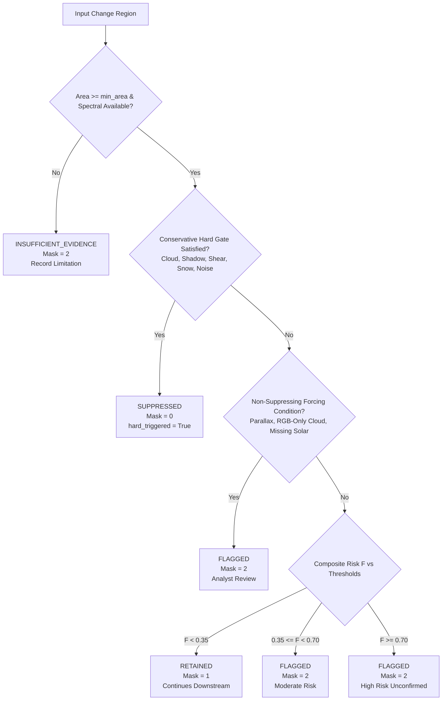

# ASTRA Phase M4D: False-Alarm Suppression Engine

## 1. M4D Purpose & Architecture

The **False-Alarm Suppression Engine (Phase M4D)** provides deterministic, explainable, conservative screening of candidate change regions to screen out false-positive detections induced by atmospheric phenomena, viewing geometry discrepancies, co-registration misalignment, sensor noise, and radiometric drift.

### Core Tenets

> [!IMPORTANT]
> **RETAINED is NOT "Verified Ground Truth"**
>
> In ASTRA Phase M4D, `RETAINED` explicitly means:
> *"No sufficient false-alarm evidence was detected; candidate continues downstream."*
> M4D does not establish ground truth or prove that a change is genuine.

> [!IMPORTANT]
> **Heuristic Risk Index $F$ is NOT a Probability**
>
> The composite artifact risk score $F \in [0.0, 1.0]$ is an **uncalibrated deterministic heuristic index**, NOT a probability, likelihood, or confidence interval.

> [!CAUTION]
> **Critical Decision Safety Rule: Composite Risk Alone NEVER Suppresses**
>
> A candidate change region is **NEVER** hard-suppressed on the basis of the composite score $F$ alone ($F \ge 0.70$). Hard suppression (`SUPPRESSED`) requires that an independent, conservative, multi-evidence physical gate is fully satisfied. Weak cloud evidence + weak haze evidence + weak illumination drift $\ne$ `SUPPRESSED` (it results in `FLAGGED`).

> [!NOTE]
> **Zero Silent Drops**
>
> Every input candidate region from M4B/M4C has a corresponding `RegionSuppression` record. Suppressed regions are preserved in serialized outputs and audited in immutable provenance records.

---

## 2. Pipeline Position

Within the ASTRA multi-temporal processing architecture, M4D sits between semantic change-type classification (M4C-B) and earliest supporting observation / temporal trajectory analysis (M4E):

```
+-------------------------------------------------------------+
| M4A: Temporal Observation Catalog & Scene Pairing           |
+-------------------------------------------------------------+
                              |
                              v
+-------------------------------------------------------------+
| M4B: Reproducible Temporal Change Detection                 |
+-------------------------------------------------------------+
                              |
                              v
+-------------------------------------------------------------+
| M4C-A: Multi-Modal Feature Evidence Extraction              |
+-------------------------------------------------------------+
                              |
                              v
+-------------------------------------------------------------+
| M4C-B: Explainable Change-Type Classification               |
+-------------------------------------------------------------+
                              |
                              v
+=============================================================+
| M4D: False-Alarm Suppression Engine (CURRENT PHASE)         |
|      - Conservative Multi-Evidence Artifact Screening       |
|      - Tri-State Filtered Change Mask (0/1/2 GeoTIFF)       |
|      - Immutable Lineage Tracking (prov_sup_{hash}.json)    |
+=============================================================+
                              |
                              v
+-------------------------------------------------------------+
| M4E: Earliest Supporting Observation & Trajectory           |
+-------------------------------------------------------------+
```

---

## 3. Artifact Taxonomy

M4D recognizes 9 primary physical failure modes and 2 operational bookkeeping/limitation types:

| Artifact Code | Phenomenon | Nature | Hard Suppression Gate? |
| :--- | :--- | :--- | :--- |
| `CLOUD_CONTAMINATION` | Bright cloud patches and puffy cumulus | Atmospheric | Yes (Requires multispectral + morphology) |
| `CLOUD_SHADOW` | Surface shadows cast by clouds | Atmospheric / Geometric | Yes (Requires directional solar ray alignment) |
| `HAZE_AEROSOL` | Diffuse atmospheric scattering | Atmospheric | No (Soft risk only) |
| `SNOW_ICE` | Ephemeral snow cover or glacial frost | Cryospheric | Yes (Requires NDSI confirmation) |
| `GLOBAL_ILLUMINATION_DRIFT`| Sun angle shift, seasonal shading | Radiometric | No (Soft risk only; contrast protected) |
| `VIEWING_GEOMETRY_PARALLAX`| Tall structure leaning / off-nadir shift | Geometric | **NEVER** (Always routes to `FLAGGED`) |
| `RADIOMETRIC_GAIN_INCONSISTENCY` | Multiplicative or sensor gain shift | Sensor / Radiometric | No (Soft risk only) |
| `COREGISTRATION_EDGE_SHEAR` | Sub-pixel / 1-2px boundary fringe | Spatial / Registration | Yes (Requires dipole sign reversal + thinness) |
| `SENSOR_NOISE_DROPOUT` | Isolated 1-2px salt-and-pepper noise | Sensor / Transmission | Yes (Restricted to $\le 2\text{ px}$ spikes) |
| `CROSS_SENSOR_LIMITATION` | Uncalibrated sensor pairings | Modality limitation | No (Soft risk + limitation record) |
| `UNKNOWN_ARTIFACT` | Unclassified anomalous response | Bookkeeping | No (Flagged for review) |

---

## 4. Detector Methodology & Negative Protection

All detectors are strictly deterministic, non-probabilistic heuristic evaluators. They execute offline without machine learning models, external APIs, or fabricated bands.

### 4.1 Cloud Contamination (`CLOUD_CONTAMINATION`)
- **Multi-Evidence Criteria**:
  1. High visible reflectance ($\ge 0.35$)
  2. High visible spectral whiteness (band deviation ratio $\le 0.15$)
  3. Deep atmospheric Cirrus absorption ($\ge 0.015$) or valid SWIR drop ($\text{SWIR} / \text{Vis} < 0.60$)
  4. Non-structural morphology ($\text{rectangularity} \le 0.50$)
- **Negative Protection**: Bright concrete roofs, industrial buildings, and white tents exhibit high rectangularity ($> 0.50$) or high SWIR reflectance and are protected from cloud suppression.
- **RGB-Only Degradation**: If SWIR and Cirrus bands are absent, cloud contamination cannot be definitively proven; the candidate degrades to `FLAGGED` with an explicit data limitation.

### 4.2 Cloud Shadow (`CLOUD_SHADOW`)
- **Multi-Evidence Criteria**:
  1. Low visible reflectance ($\le 0.10$)
  2. Low NIR reflectance ($\le 0.12$)
  3. Valid solar geometry ($\phi_s$ solar azimuth available)
  4. Spatial alignment along solar azimuth ray from an identified cloud candidate
- **Negative Protection**: Dark water expansion and burned agricultural parcels lack supporting directional cloud candidates along the solar ray and are strictly retained.
- **Missing Solar Metadata**: Degrades to `FLAGGED` with explicit notice: *"Missing solar geometry; cloud shadow cannot be directionally confirmed"*.

### 4.3 Co-Registration Edge Shear (`COREGISTRATION_EDGE_SHEAR`)
- **Multi-Evidence Criteria**:
  1. High static edge overlap ($\ge 0.70$)
  2. Boundary fringe thinness ($\text{compactness} \le 0.08$)
  3. Narrow minor axis width ($\le 2.0\text{ px}$)
  4. Dipole sign reversal ($\Delta > 0$ on one side, $\Delta < 0$ on opposing side)
- **Negative Protection**: Narrow genuine roads with uniform positive delta and interior width ($> 2.0\text{ px}$) or lacking dipole anti-symmetry are retained.

### 4.4 Snow / Ice (`SNOW_ICE`)
- **Multi-Evidence Criteria**:
  1. Normalized Difference Snow Index: $\text{NDSI} = \frac{\text{Green} - \text{SWIR}}{\text{Green} + \text{SWIR}} \ge 0.40$
  2. High Green reflectance ($\ge 0.25$)
  3. Explicitly mapped Green and SWIR wavelengths
- **RGB-Only Degradation**: Degrades to `FLAGGED` or `INSUFFICIENT_EVIDENCE` with notice: *"SWIR band unavailable; snow cannot be confirmed"*.

### 4.5 Viewing Geometry Parallax (`VIEWING_GEOMETRY_PARALLAX`)
- Tall structures (buildings, bridges) exhibit apparent displacement between off-nadir acquisitions.
- **Mandatory Policy**: Parallax **NEVER** triggers hard suppression. It always produces `FLAGGED` and is routed to analyst inspection.

### 4.6 Global Illumination Drift (`GLOBAL_ILLUMINATION_DRIFT`)
- Detects tile-wide baseline shifts ($\ge 0.20$) strongly coupled with surrounding background change ($\ge 0.75$).
- **Local Contrast Protection**: Candidates with local contrast $\ge 0.15$ relative to the shifted background are exempted from penalty and retained.

---

## 5. Composite Heuristic Risk & Decision Order

The composite heuristic risk index $F$ accumulates weighted evidence across all 11 detectors:

$$F = \min\left(1.0, \sum_{k=1}^{11} w_k \cdot s_k\right)$$

Where $s_k \in [0.0, 1.0]$ is the heuristic evidence strength and $w_k \in [0.0, 1.0]$ is the configured detector weight.

### Decision Pipeline (4 Steps)



---

## 6. Tri-State Filtered Change Mask

The raster mask `filtered_change_mask.tif` is serialized as a single-band uint8 GeoTIFF preserving native geospatial reference metadata (CRS and affine geotransform):

| Pixel Value | Semantic Label | Downstream Handling |
| :---: | :--- | :--- |
| `0` | Background / Suppressed | Excluded from downstream reporting; preserved in metadata |
| `1` | Retained Candidate | Continues downstream to Phase M4E (not ground truth) |
| `2` | Flagged / Insufficient Evidence | Routed to human analyst triage queue |

---

## 7. Lineage & Provenance

For every screening execution, an immutable provenance record conforming to `ASTRA-DC-v0.1` is persisted under:
`data/manifests/provenance/prov_sup_{hash}.json`

The document identity `sup_{hash}` and `prov_sup_{hash}` are strictly deterministic hashes computed from:
- `evidence_id`
- `classification_id`
- `suppressor_id`
- `suppressor_version`
- Total input regions count

---

## 8. REST API Endpoints

Mounted under `/api/v1/change-suppression`:

### `POST /api/v1/change-suppression/suppress`
Executes false-alarm screening across all candidate regions.
- **Request**:
  ```json
  {
    "evidence_id": "evi_mock_001",
    "classification_id": "cls_mock_001",
    "config_overrides": {
      "suppression_threshold": 0.70,
      "flag_threshold": 0.35
    },
    "auxiliary_data": {
      "solar_azimuth": 145.0
    }
  }
  ```
- **Response**: `SuppressionResult` JSON document conforming to `ASTRA-DC-v0.1`.

### `GET /api/v1/change-suppression/results/{suppression_id}`
Retrieves a persisted `SuppressionResult` by its deterministic ID.

### `GET /api/v1/change-suppression/results/{suppression_id}/mask`
Streams the serialized tri-state `filtered_change_mask.tif` GeoTIFF raster.

### `GET /api/v1/change-suppression/health`
Returns system operational status, suppressor metadata, and storage statistics.

---

## 9. CLI Usage

Run change suppression offline via the CLI script:

```bash
# Evaluate by evidence ID
python scripts/run_change_suppression.py --evidence-id evi_...

# Evaluate direct JSON file with solar metadata
python scripts/run_change_suppression.py \
    --evidence-file data/change_classification/evi_.../evidence.json \
    --solar-azimuth 142.5 \
    --suppression-threshold 0.70 \
    --flag-threshold 0.35

# Emit raw JSON to stdout
python scripts/run_change_suppression.py --evidence-id evi_... --json
```

---

## 10. Known Limitations

1. **Monocular Height Ambiguity**: Without stereoscopic photogrammetry or high-density DSMs, viewing parallax is flagged heuristically rather than geometrically modeled.
2. **RGB Spectral Blinding**: Without SWIR and Cirrus channels, subtle cirrus clouds and thin snow cover cannot be definitively separated from bright man-made surfaces. They gracefully degrade to `FLAGGED` rather than risking false suppression.
3. **Cross-Sensor Uncalibrated Radiometry**: When pairing heterogenous platforms (e.g., Sentinel-2 MSI and Landsat-8 OLI), absolute radiometric calibration is unassumed, and radiometric hard suppression is inhibited.
