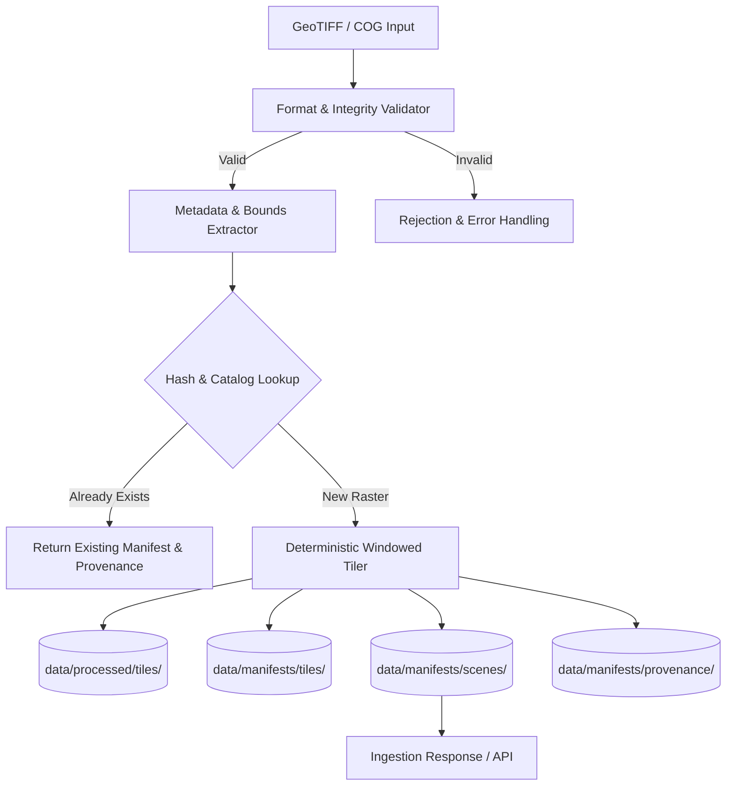

# A.S.T.R.A. Ingestion Subsystem Specification

**Component:** Geospatial Ingestion Vertical Slice  
**Phase:** Phase 1 (Approved & Implemented)  
**Standard:** ASTRA-DC-v0.1

---

## 1. Overview & Objectives

The Ingestion Subsystem provides the foundation for Earth Observation data processing in A.S.T.R.A. It transforms large, heterogeneous satellite raster scenes into georeferenced, deterministically identified chips while preserving complete spatial, radiometric, and temporal metadata.



---

## 2. Supported Formats

- **Standard GeoTIFF (`.tif`, `.tiff`)**: Multi-band, projected or geographic coordinate reference systems, 8-bit to 32-bit integer or floating-point radiometric depths.
- **Cloud Optimized GeoTIFF (COG)**: Automatically recognized via internal tiling structures (`tiled=True`) and pyramid overview levels.

All operations execute strictly offline via local `rasterio` (GDAL backend) and `Pillow`.

---

## 3. Ingestion Workflow

1. **Format & Safety Validation (`validator.py`)**:
   - Ensures local file exists, is non-empty, and opens safely without memory corruption.
   - Verifies GDAL driver is `GTiff`.
   - Checks for COG internal tile block geometries and decimation overviews.
2. **Metadata & Coordinate Extraction (`extractor.py`)**:
   - **CRS**: Extracts EPSG authority code (e.g. `EPSG:32643`, `EPSG:4326`) or WKT.
   - **Geographic Bounds**: Transforms projected bounding coordinates to WGS84 (`EPSG:4326`) latitude/longitude using `rasterio.warp.transform_bounds`.
   - **Spatial Resolution**: Computes pixel ground-sample distance (GSD) from the affine transform matrix.
   - **Acquisition Timestamp**: Parses standard TIFF metadata tags (`TIFFTAG_DATETIME`) or structured filename dates. Does NOT invent fake timestamps.
   - **Sensor & Platform**: Extracts sensor instrument descriptions or identifies standard naming conventions (`Sentinel-2`, `Landsat-8/9`).
   - **Quality & Nodata**: Records nodata value and pixel array statistics.
3. **Incremental Ingestion & Duplicate Detection (`service.py`)**:
   - Computes whole-file SHA-256 hash.
   - Checks catalog (`data/manifests/scenes/`) for existing entries matching the hash.
   - If previously ingested, returns `status: "already_ingested"` and skips re-tiling, preserving the original provenance record.
4. **Deterministic Windowed Tiling (`tiler.py`)**:
   - Uses `rasterio.windows.Window` to slice chips without loading full gigabyte-scale rasters into memory.
   - Generates deterministic grid coordinates: `tile_{scene_id}_c{col:04d}_r{row:04d}_z{zoom:02d}`.
   - Computes individual tile SHA-256 pixel checksum.
   - Calculates geographic bounds for each sub-window in WGS84.
   - Saves tile image representations to `data/processed/tiles/{scene_id}/`.
5. **Provenance Registration (`provenance/service.py`)**:
   - Issues a cryptographic `ProvenanceRecord` detailing pipeline version, hyperparameters, execution timestamp, and source scene ID.
   - Persists record in `data/manifests/provenance/{prov_id}.json`.

---

## 4. Stable Tile Identity & Scene Linkage

In accordance with **Critical Architectural Rules 3, 4, and 5**:
- Every tile identifier is derived deterministically from the parent scene ID, grid column, grid row, and zoom level:
  $$\text{tile\_id} = \text{tile\_}\{\text{scene\_id}\}\_\text{c}\{\text{col}\}\_\text{r}\{\text{row}\}\_\text{z}\{\text{zoom}\}$$
- The invariant holds for every generated chip:
  $$\text{tile}.\text{source\_scene\_id} == \text{scene}.\text{scene\_id}$$
- Re-running ingestion on the identical scene and tiling configuration always yields identical tile IDs and checksums.

---

## 5. REST API Specifications

### `POST /api/v1/ingestion`
Ingests a local raster scene.
- **Request Body:**
  ```json
  {
    "file_path": "data/raw/synthetic/synthetic_S2A_20260315_utm.tif",
    "tile_size": 512,
    "force_reprocess": false
  }
  ```
- **Response (HTTP 201):**
  ```json
  {
    "status": "ingested",
    "message": "Successfully ingested scene 'synthetic_S2A_20260315_utm_9a2f1b4c'...",
    "scene": { ... },
    "tile_count": 4,
    "provenance_id": "prov_a1b2c3d4e5f6"
  }
  ```

### `GET /api/v1/ingestion/{scene_id}`
Returns the complete `SceneManifest` for the specified scene ID.

### `GET /api/v1/scenes`
Lists summary metadata for all ingested scenes in the catalog.

### `GET /api/v1/scenes/{scene_id}/tiles`
Lists all `TileManifest` records generated for the scene.

---

## 6. CLI Developer Interface

Run single-command local raster ingestion:
```powershell
python scripts/ingest.py <path_to_raster> [--tile-size 512] [--force]
```

Example Output:
```text
==================================================
A.S.T.R.A. Geospatial Ingestion Pipeline (Phase 1)
==================================================
Target Raster : data/raw/synthetic/synthetic_S2A_20260315_utm.tif
Tile Size     : 512x512
Force Reprocess: False
--------------------------------------------------
Scene ID          : synthetic_S2A_20260315_utm_9a2f1b4c
Format            : Standard GeoTIFF
CRS               : EPSG:32643
Bounds (WGS84)    : Lon [76.842101, 76.936521] | Lat [12.654312, 12.746819]
Acquisition       : 2026-03-15T05:20:21+00:00
Sensor            : Sentinel-2A MSI (Platform: Sentinel-2)
Dimensions        : 1024 x 1024 (Bands: 3)
Bands             : B02_Blue, B03_Green, B04_Red
Tile Count        : 4 chips
Provenance Status : Recorded (prov_9b8a7c6d5e4f3a2b)
Ingestion Status  : INGESTED
Synthetic Data    : True
==================================================
[SUCCESS] Ingestion slice completed successfully.
```

---

## 7. Known Limitations & Phase Boundaries

- **No Semantic Inference:** Model embedding generation is deferred to Phase 2.
- **No In-Memory Vector Search:** FAISS indexing occurs on chipped tiles during Phase 2.
- **Single Machine Storage:** Manifests and tiles are persisted on the local filesystem; distributed object stores (e.g. S3/MinIO) are not introduced in keeping with anti-bloat principles.
